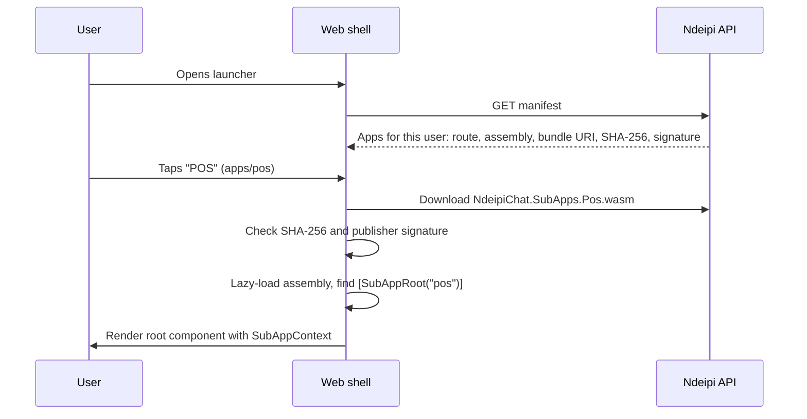

# How micro-apps plug into Ndeipi

A micro-app (the code calls it a *sub-app*) is a Blazor component library that the Ndeipi shell
downloads the first time someone opens it, checks, and runs with the user already signed in. POS,
Gigs, Events and Inventory are built this way. This guide explains how it works and what an
engineer needs to add a new one. The step-by-step reference, including signing and key rotation, is
[Building a sub-app](sub-apps.md).

## The model

The launcher shows two kinds of app side by side. Only the second kind can be built outside the
core team.

| Kind | Examples | Where the code lives | How it ships |
|---|---|---|---|
| Built-in | Chats, Feed, Shamwaris, Wallet, Herd | Inside the shell (web pages, native MAUI pages on the phone) | With the shell and the phone app |
| Micro-app | POS, Gigs, Events, Inventory | Its own Razor Class Library, `NdeipiChat.SubApps.{Name}` | Published with the site as a separate `.wasm`, lazy-loaded on first open |

Everything runs as Blazor WebAssembly on .NET 10. A micro-app is an ordinary Razor component tree.
It has no `Program.cs`, no router and no sign-in page; the shell supplies all of that.

## How an app loads



1. **The manifest decides who sees the app.** The API merges the built-in catalogue with
   `Launcher:Apps` in `appsettings.json`, drops apps whose roles the user lacks, and drops any app
   whose bundle wasn't published. For each remaining app it adds the bundle's URI, its SHA-256,
   and the publisher's signature from `subapp-signatures.json`.
2. **The shell verifies before it runs anything.** `SubAppHost.razor` downloads the bundle,
   compares its hash to the manifest, and checks the signature with `SubAppVerifier` against public
   keys compiled into the shell (`PublisherKeys.All`). It never trusts a key the server sends. If
   either check fails, the app doesn't load.
3. **It lazy-loads and renders.** `SubAppDiscovery.FindRoot` finds the component marked
   `[SubAppRoot("pos")]`, and the shell renders it in a `<DynamicComponent>` inside an error
   boundary, so a crash stays inside the app.
4. **It stays loaded.** Reopening the app in the same session is instant.

## What the shell gives you

Your root component receives one cascading parameter, `SubAppContext`, from
`NdeipiChat.SubApps.Sdk`. It is the whole contract between shell and app.

| Member | What it is |
|---|---|
| `AppId` | Your app's id, e.g. `"pos"`. |
| `UserId`, `DisplayName` | The signed-in person. |
| `Api` | An `HttpClient` for the Ndeipi API that already carries the user's sign-in. Use relative paths such as `api/pos/...`. The shell adds and refreshes the token; your code never sees it. |
| `NavigateToLauncher` | Takes the user back to the launcher (or closes the page on the phone). |
| `Realtime` | `ISubAppRealtime`: subscribe to topics such as `events:{id}` over the shell's SignalR connection. The shell re-subscribes after a reconnect. May be null. |
| `Device` | `ISubAppDevice`: ECDSA P-256 keys that never leave the device, plus small stored values, kept separate per app and per user. May be null. |
| `Query` | The query string the app was opened with, e.g. `chat={id}` when launched from a chat's "+" panel. |

```razor
@attribute [SubAppRoot("pos")]

@code {
    [CascadingParameter] public SubAppContext Context { get; set; } = null!;

    protected override async Task OnInitializedAsync()
    {
        var me = await Context.Api.GetFromJsonAsync<PosMeDto>("api/pos/me");
        if (Context.Realtime is { } live)
            _sub = await live.SubscribeAsync($"pos:{me!.StoreId}", OnMessageAsync);
    }
}
```

For browser features Blazor can't reach (camera, barcode detection, idle timers, printing), ship a
JS module in the library's `wwwroot` and import it with `IJSRuntime`. POS does this in
`wwwroot/pos.js`.

## The server half

Most micro-apps need an API. Today that API lives in `NdeipiChat.Api` as a *module*: a folder with
a service, a module class, and its EF entities.

```csharp
// NdeipiChat.Api/Pos/PosModule.cs
public static IServiceCollection AddPos(this IServiceCollection services) => ...;

public static void MapPos(this WebApplication app)
{
    var api = app.MapGroup("/" + PosContract.BasePath)      // "api/pos"
                 .RequireAuthorization()
                 .RequireSubApp(PosContract.AppId);          // "pos"
    ...
}
```

- **`RequireSubApp(id)` is required on every endpoint.** It applies the same rules as the
  manifest: if the user can't see the app in their launcher (missing role, or no published
  bundle), the endpoint returns 403.
- **Shared DTOs go in `NdeipiChat.Contracts`.** For example, `Pos.cs` holds `PosContract`, the
  DTOs, and `PosPricing`, which both the till and the server use to price a cart. Client and server
  then agree at compile time.
- **Realtime topics need a policy.** Implement `ITopicPolicy` (a `Prefix` such as `"events"` and
  `CanSubscribeAsync(user, key)`), register it in your `Add…()`, and publish with
  `ChatNotifier.PublishAsync`. The hub refuses subscriptions no policy allows. See
  `EventTopicPolicy` and `GigMapTopicPolicy`.
- **Data** goes in `ChatDbContext` with an EF migration. Prefix your tables with the app's name
  (`PosSale`, `PosStock`).
- **Reusing platform features** means calling the platform services directly. POS sends receipts
  into a chat through `ConversationService` and `MessageService`.

## Phone and desktop

**Android and iOS.** App stores forbid downloading native code, so the phone never loads a .NET
DLL at runtime. Micro-apps open in an in-app WebView (`WebSubAppPage`) showing the web shell's
`apps/{id}` page in **embedded mode**: no shell navigation, and "back" goes to `embed/close`, which
the app catches. The phone verifies the bundle itself with the keys shipped in the store-signed
app, then hands over its sign-in with a one-time PKCE code (`AuthService.CreateWebHandoffAsync`).
A new micro-app needs no phone release.

**Desktop.** The desktop app wraps `chat.ndeipi.com`, so micro-apps behave exactly as they do in a
browser.

**What this means for you.** Build and test in the browser, then check the phone at 400px wide.
Hide your own header in embedded mode if the phone page already shows one (POS uses
`.content.embedded header.pos-bar { display: none; }`).

## Build one

Using a hypothetical *Bookings* app with id `bookings`. POS is the fullest example to copy;
Inventory is the smallest.

1. **Create the library.**
   ```bash
   dotnet new razorclasslib -n NdeipiChat.SubApps.Bookings -o src/NdeipiChat.SubApps.Bookings
   ```
   Reference `NdeipiChat.SubApps.Sdk` and `NdeipiChat.Contracts`.
2. **Define the contract** in `NdeipiChat.Contracts/Bookings.cs`: `BookingsContract.AppId`,
   `BasePath`, and the request and response records.
3. **Add the root component** with `@attribute [SubAppRoot("bookings")]` and the `SubAppContext`
   cascading parameter.
4. **Add the API module** under `NdeipiChat.Api/Bookings/` with `AddBookings()` and
   `MapBookings()`, every route behind `.RequireAuthorization().RequireSubApp("bookings")`. Wire
   both into `Program.cs`. Add entities and a migration if you store data.
5. **Reference it from the web shell** in `NdeipiChat.Web.csproj`:
   ```xml
   <ProjectReference Include="..\NdeipiChat.SubApps.Bookings\NdeipiChat.SubApps.Bookings.csproj" />
   <BlazorWebAssemblyLazyLoad Include="NdeipiChat.SubApps.Bookings.wasm" />
   <TrimmerRootAssembly Include="NdeipiChat.SubApps.Bookings" />
   ```
   `TrimmerRootAssembly` matters: the root is found only by reflection, so without it the trimmer
   removes it.
6. **List it in the launcher** in `appsettings.json`:
   ```json
   "bookings": {
     "Title": "Bookings", "Icon": "📅", "Route": "apps/bookings",
     "Assembly": "NdeipiChat.SubApps.Bookings",
     "RequiredRoles": [], "Order": 58
   }
   ```
7. **Test it.** Add integration tests in `tests/NdeipiChat.Tests` (see `PosTests.cs`) and add the
   id to the expected list in `LauncherTests`. Tests fail with 403 until the project exists,
   because an app without a bundle is hidden.
8. **Release.** Publishing the API signs every sub-app bundle with the publisher key
   (`SignSubAppBundles` target). Apply the migration to production, then publish the site.

## House rules

- **Use the shell's styles** (`bar`, `page`, `list`, `row`, `form`, `field`, button classes and the
  CSS tokens) so every app looks like Ndeipi in light and dark. Prefix any extra classes with your
  app id (`pos-card`).
- **Never ask for a sign-in and never touch tokens.** Use `Context.Api`.
- **Never trust the client.** The server re-checks permissions, prices and totals. POS reprices
  every sale on the server with the same `PosPricing` code.
- **Check that `Realtime` and `Device` aren't null** before using them.
- **Make writes idempotent** when a device might retry (POS uses a client-generated sale id).

## Limits today

The system was built for one team in one repository. Several things need to change before
independent teams can ship on their own.

| Area | Today | Multi-team ready? |
|---|---|---|
| Deploying | Blazor only lazy-loads assemblies that were published with the site, so every new app or update means a full site release from the monorepo. | No |
| Backend | All modules share one API process and one `ChatDbContext`. One module's migration or crash affects everyone. | No |
| Isolation | Micro-apps run in the same WASM runtime and origin as the shell. An app can call any API the user can and could read the tokens in `localStorage`. Signing proves who published a bundle; it doesn't sandbox it. | No |
| Permissions | `Scopes` and `MinShellVersion` are declared in the manifest but not enforced. | No |
| Signing | One publisher key signs every bundle. | No |
| Contract | `SubAppContext` is small, stable and documented. | Yes |
| Phone | New apps need no phone release; bundles are verified on the device. | Yes |

**In short:** any engineer on the team can build a micro-app today, but everyone is fully trusted
and releases together. Treat micro-app code with the same review as shell code.

## Opening it to more teams

**Internal teams (now):**

- Add `CODEOWNERS` entries per `SubApps.{Name}` project, API module folder and contract file, so
  each team owns its code and the core team reviews shell, SDK and contract changes.
- Agree the contract in `NdeipiChat.Contracts` first, then build client and server in parallel.
- Enforce `Scopes` server-side, so an app can only reach its own routes and the platform APIs it
  declared.
- Give each team a project template for the steps above.

**External or independent teams (later):**

- Run each app on its own origin inside a sandboxed iframe, talking to the shell through a small
  `postMessage` bridge that mirrors `SubAppContext`.
- Issue short-lived, app-scoped tokens instead of sharing the user's session.
- Let each app run its own backend and database, deployed on its own schedule.
- Give each publisher its own signing key, with a registry to add and revoke them.

That second stage also lets teams use any web stack, not only Blazor, because the contract becomes
messages rather than a .NET type.

## Key files

| File | Role |
|---|---|
| `src/NdeipiChat.SubApps.Sdk/SubAppSdk.cs` | `SubAppRoot`, `SubAppContext`, `ISubAppRealtime`, `ISubAppDevice` |
| `src/NdeipiChat.Web/Pages/SubAppHost.razor` | Downloads, verifies, loads and renders an app |
| `src/NdeipiChat.Api/Launcher/LauncherModule.cs` | Manifest, role filtering, `RequireSubApp` |
| `src/NdeipiChat.Api/Launcher/SubAppBundles.cs` | Finds published bundles, hashes and signatures |
| `src/NdeipiChat.Client.Core/PublisherKeys.cs` | Trusted publisher public keys |
| `src/NdeipiChat.Api/Chat/ChatHub.cs` | `ITopicPolicy` and topic subscriptions |
| `tools/NdeipiChat.SubAppSigner` | Key generation and bundle signing |
| `src/NdeipiChat.App/Pages/Pages.xaml.cs` | `WebSubAppPage`: the phone's WebView host |
| `docs/sub-apps.md` | Step-by-step reference, including key rotation |
